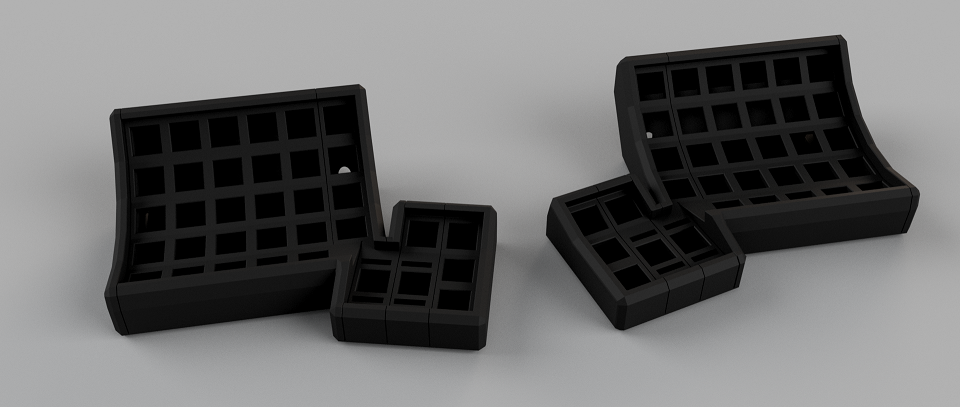
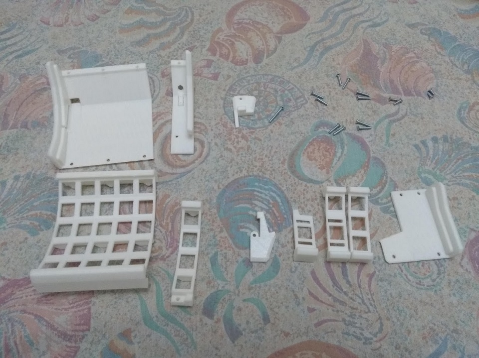
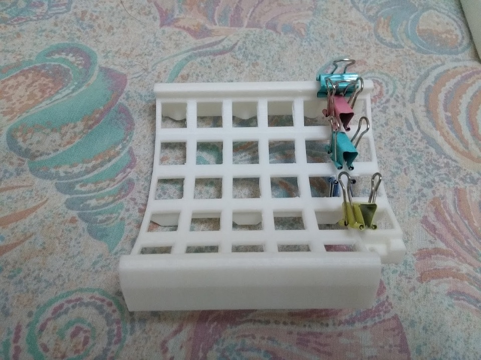
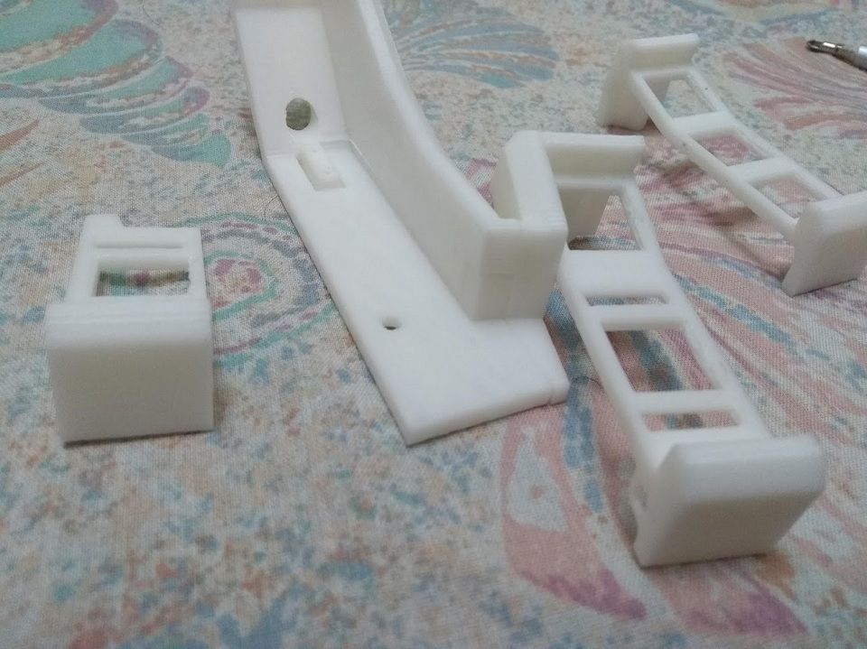
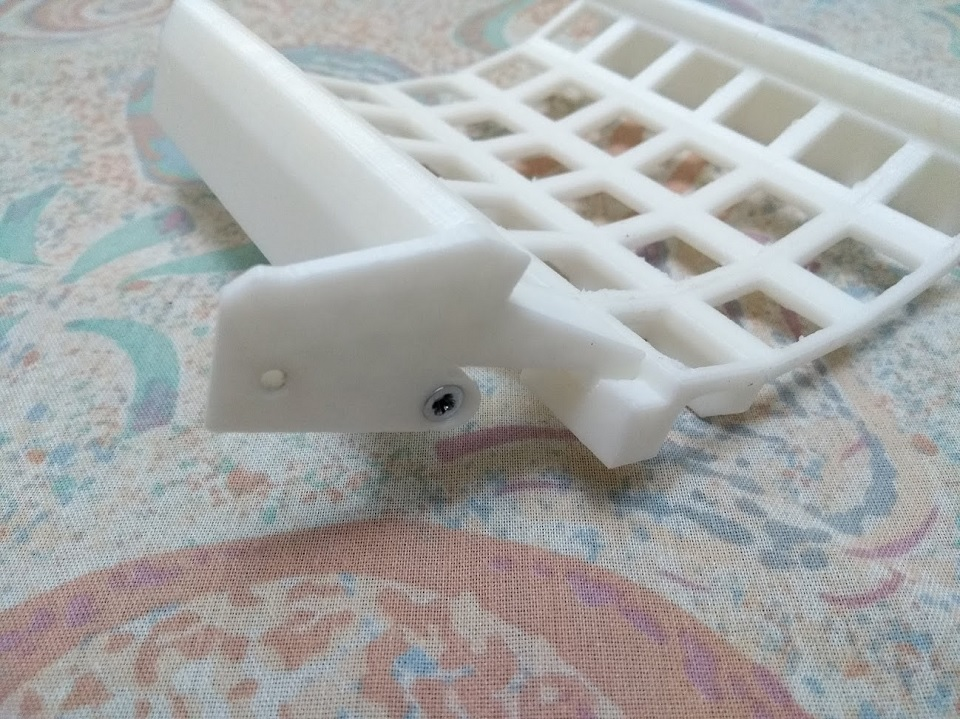
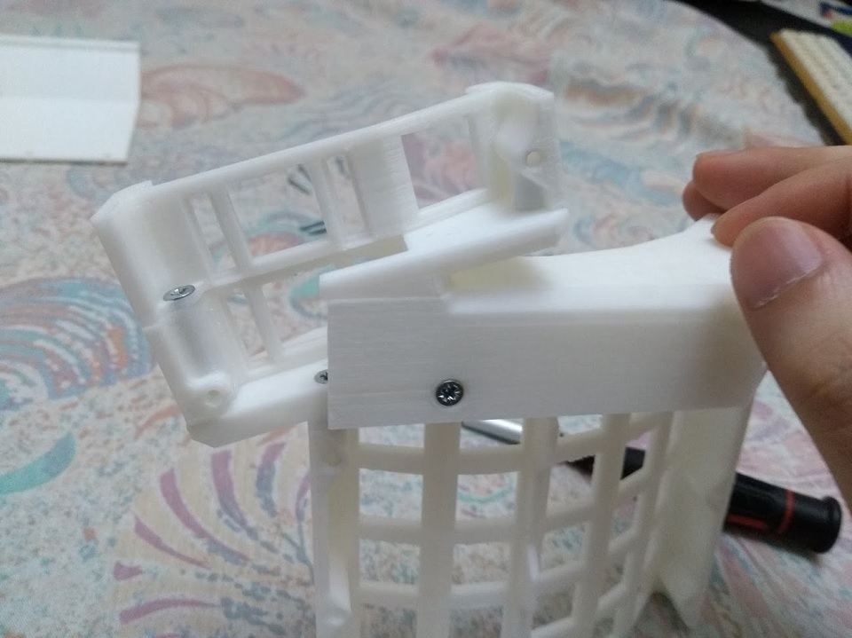
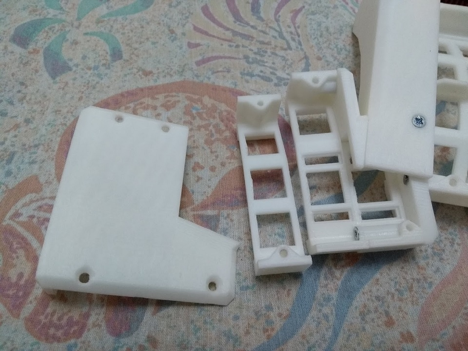
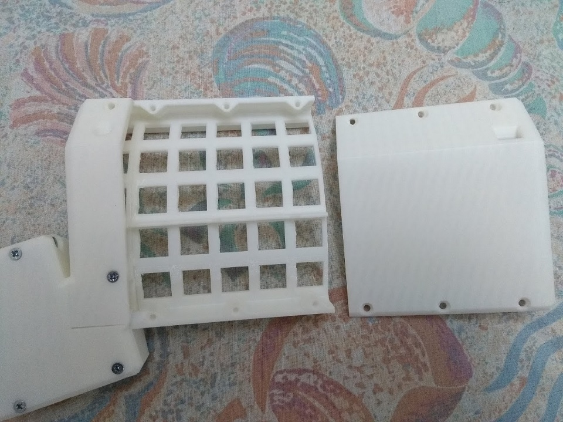

# Dactyl EZ-to-Print

An easy-to-print ortholinear [dactyl](https://github.com/adereth/dactyl-keyboard)-like keyboard that requires no support! An accompanying blog post can be found [here](https://ramonimbao.github.io/ergodox-easy/).

## Printing

Print the STL files as oriented. No support generation required. If exported from Fusion 360, a certain face of each part has a 0.4 mm chamfer to account for [elephant's foot](https://all3dp.com/2/elephant-s-foot-3d-printing-problem-easy-fixes/). Orient the part such that that face is the bottom.

## Hardware

These files were designed for the blue Arduino Pro Micro and the [RS Pro 805-1661 4-pole composite video jack](https://octopart.com/8051661-rs+pro-103323509) in mind, which is a mistake because I thought those were TRRS jacks! Anyway, besides those two and the 3D prints, the additional hardware you need are:

- 1× M3×25 countersunk head screw
- 10× M3×16 countersunk head screw
- 2× M3×10 countersunk head screw
- 2× M3×8 countersunk head screw

Quantities are for one half only.

## Assembly

Glue `Column_TGB` to `Columns_Alpha`. Here, I used some bulldog clips to align everything before gluing.

Use an M3×10 screw to connect `ThumbCluster_B` to `Cap_Mini`.

Slot the subassembly onto `Cap_TGB`.

Use an M3×10 screw to connect `SmallCap` to the alpha columns subassembly that was glued together.

Use an M3×25 screw to connect the thumb cluster subassembly to the alpha columns, making sure to sandwich `ThumbCluster_A` between them.

Use two M3×16 screws and two M3×8 screws to connect the whole subassembly, `ThumbCluster_C` and `Cap_ThumbCluster`. The two M3×16 screws are for the back of the thumb cluster while the two M3×8 screws are for the front.

Finally, connect the whole assembly and `Cap_Alpha` using M3×16 screws. You're done!

## License

The files and the source are licensed under GNU GPLv3. Please see the [LICENSE.md](LICENSE.md) for more details.
